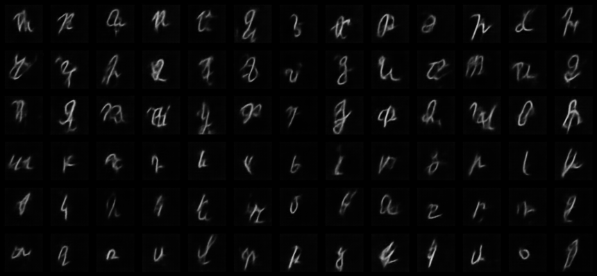
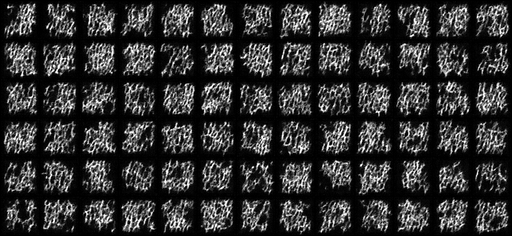
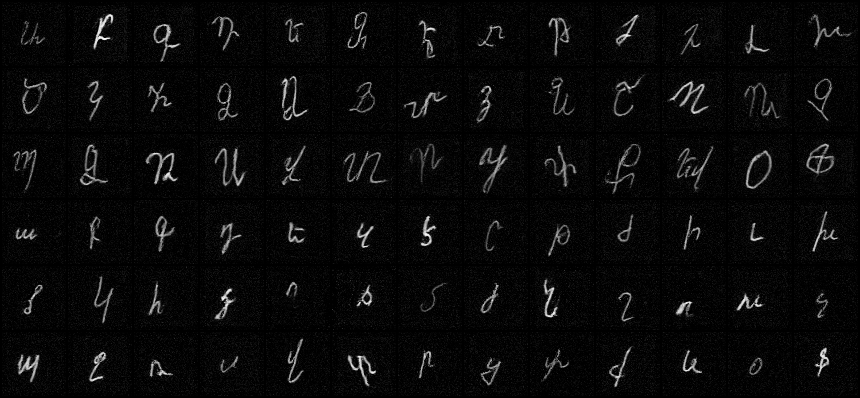
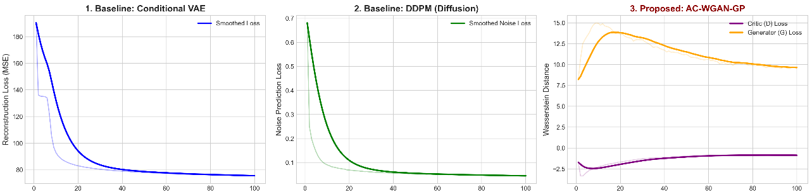

# Armenian Handwritten Text Synthesis via AC-WGAN-GP
**Authors:**
* [Narek Stepanyan](https://github.com/Narek889)
* [Srbuhi Pupuyan](https://github.com/Srbuhi01)

**Institution:** [National Polytechnic University of Armenia](https://polytech.am/en/home/)

**Year:** 2026

**An Automated End-to-End System for Synthetic Handwriting Generation and Data Augmentation**


## 📌 Project Overview
The development of highly accurate Optical Character Recognition (OCR) systems for the Armenian language is severely bottlenecked by the scarcity of labeled handwritten datasets. This project proposes a robust **Data Augmentation** pipeline based on Generative Adversarial Networks (GANs).

The system is capable of synthesizing absolutely realistic, structurally accurate Armenian characters (78 classes) from zero (latent noise). It successfully concatenates them into full cursive words and dynamically blends the synthetic text onto real-world backgrounds (e.g., paper, parchment) with optimal contrast.

## 🚀 Key Features
- **AC-WGAN-GP Architecture:** Utilizes Wasserstein Distance and Gradient Penalty to ensure perfect training stability and eliminate Mode Collapse.
- **Style Consistency:** By freezing the latent vector ($Z$) across character generations, the system guarantees that an entire sentence is written in a single, consistent handwriting style.
- **Digraph-aware Tokenizer:** Automatically detects and manages complex Armenian character combinations (e.g., ու, և, Եվ) and inter-word spaces.
- **Computer Vision Post-processing:** Applies OpenCV's Gaussian Blur and Dilation algorithms to ensure smooth cursive connectivity between generated characters.
- **Dynamic Background Overlay:** Automatically calculates background luminance (using the BT.601 formula) and performs RGB inversion of the text to guarantee maximum legibility on dark backgrounds.

## 📊 Fair Comparison (Model Evaluation)
To empirically justify our architectural choice, we conducted a fair comparison by training two baseline models alongside our proposed model (100 epochs each on the Mashtots dataset):
1. **cVAE (Variational Autoencoder):** Showed ideal MSE loss convergence but produced heavily blurred images due to pixel averaging.
2. **DDPM (Diffusion Model):** Showed a steady noise-prediction loss decrease, but 100 epochs were insufficient for clean generation. The requirement of 250+ Markov steps makes it computationally inefficient for massive data augmentation.
3. **Proposed AC-WGAN-GP:** Demonstrated classic Nash Equilibrium dynamics (Min-Max game) and successfully reproduced high-contrast, sharp strokes in a Single Forward Pass.

### Visual Comparison at Epoch 100
To demonstrate the practical difference, here are the raw generated samples from all three models at exactly the 100th epoch:

<table align="center">
  <tr>
    <td align="center"><b>1. cVAE (Baseline)</b></td>
    <td align="center"><b>2. DDPM (Diffusion)</b></td>
    <td align="center"><b>3. AC-WGAN-GP (Proposed)</b></td>
  </tr>
  <tr>
    <td></td>
    <td></td>
    <td></td>
  </tr>
  <tr>
    <td><i>Result: Highly blurred edges due to MSE pixel-averaging.</i></td>
    <td><i>Result: Structure is forming, but heavily corrupted by Markovian noise.</i></td>
    <td><i>Result: Sharp, realistic, and high-contrast strokes.</i></td>
  </tr>
</table>



## 📁 Repository Structure

```text
📦 Armenian-Handwriting-GAN
 ┣ 📂 images/                     # Output samples, graphs, and final results
 ┃ ┣ 📜 acgan_sample.png
 ┃ ┣ 📜 clean_comparison_100_epochs.png
 ┃ ┣ 📜 ddpm_sample.png
 ┃ ┣ 📜 my_text.png
 ┃ ┣ 📜 vae_sample.png
 ┃ ┗ 📜 wow_result.jpg
 ┣ 📂 notebooks/
 ┃ ┗ 📂 .gradio
 ┃   ┗ 📜 model_results.ipynb     # Jupyter notebook with detailed visualizations
 ┗ 📂 src/                        # Core source code
   ┣ 📜 0.2_new_app.py            # Gradio/Streamlit UI Application
   ┣ 📜 apply_background.py       # Basic background overlay script
   ┣ 📜 auto_color_overlay.py     # Smart overlay with dynamic luminance analysis
   ┣ 📜 baseline_cvae.py          # cVAE baseline model training script
   ┣ 📜 baseline_ddpm.py          # DDPM baseline model training script
   ┣ 📜 cvae_plot_graphs.py       # Matplotlib script for VAE loss plotting
   ┣ 📜 dataset.py                # DataLoader and preprocessing pipeline
   ┣ 📜 generate_3.py             # Inference script with CV post-processing
   ┣ 📜 model.py                  # AC-WGAN-GP network architecture
   ┣ 📜 plot_comparison.py        # Academic convergence comparison plotter
   ┗ 📜 train.py                  # Main WGAN-GP training loop
```

## ⚙️ Installation & Usage

### 1. Install Dependencies
```bash
pip install -r requirements.txt
```

### 2. Interactive UI Application
To run the web interface for text generation:
```bash
cd src
python 0.2_new_app.py
```

### 3. Model Training (From Scratch)
To train the main AC-WGAN-GP model:
```bash
cd src
python train.py --epochs 300 --batch_size 64 --n_critic 5 --lambda_gp 10.0
```

## 📚 References

1. Radford, A. et al. (2015). *Unsupervised Representation Learning with Deep Convolutional Generative Adversarial Networks*. ICLR.
2. Odena, A., Olah, C., & Shlens, J. (2017). *Conditional Image Synthesis with Auxiliary Classifier GANs*. ICML.
3. Gulrajani, I. et al. (2017). *Improved Training of Wasserstein GANs*. NeurIPS.
4. Ho, J., Jain, A., & Abbeel, P. (2020). *Denoising Diffusion Probabilistic Models*. NeurIPS.
5. Khachatrian, H. et al. (2019). *Mashtots: A Large-Scale Armenian Handwritten Character Dataset*. arXiv:1906.03666.
6. Kang, H. et al. (2020). *GANwriting: Content-Conditioned Generation of Styled Handwritten Word Images*. ECCV.
